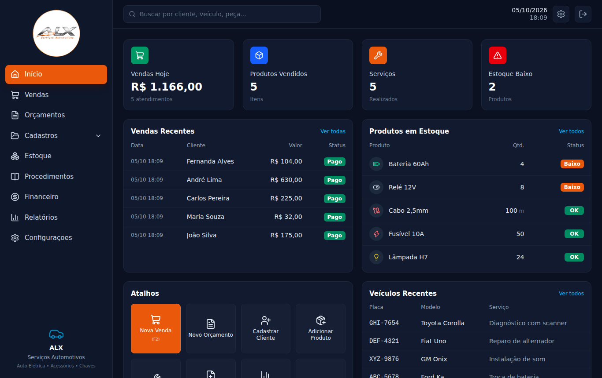

# ALX Auto Elétrica

Sistema de gestão para auto elétrica: vendas e ordens de serviço, orçamentos, clientes, veículos, estoque, fornecedores, histórico técnico e atalhos para NFS-e MEI.

Arquitetura e decisões: [`docs/ARQUITETURA.md`](docs/ARQUITETURA.md).



## Requisitos

- Node.js 22 ou superior

## Primeiros passos

```bash
npm install
cp backend/.env.example backend/.env   # se ainda não existir
npm run db:push                        # cria o banco SQLite em backend/prisma/alx.db
npm run db:seed                        # dados de exemplo (opcional)
npm run dev                            # tela em http://localhost:5173 (API na 3000)
```

### Uso no dia a dia (modo produção)

```bash
npm run build    # compila tela e API
npm start        # tudo em http://localhost:3000
```

Ao iniciar, o servidor mostra o endereço para abrir no celular conectado ao mesmo Wi-Fi (ex.: `http://192.168.1.10:3000`). No Windows, libere a porta 3000 no firewall na primeira vez.

## Comandos

| Comando | O que faz |
|---|---|
| `npm run dev` | inicia API e tela com recarga automática |
| `npm run build` / `npm start` | compila e roda em modo produção, numa porta só |
| `npm test` | roda os testes (usa um banco separado, `test.db`) |
| `npm run typecheck` | checagem de tipos (API e tela) |
| `npm run db:push` | aplica o `schema.prisma` no banco |
| `npm run db:backup` | salva uma cópia datada do banco em `backups/` |

## API

Todos os cadastros seguem o mesmo padrão: `GET /` (com `?busca=&pagina=&porPagina=`), `GET /:id`, `POST /`, `PUT /:id`, `DELETE /:id`.

| Recurso | Rota | Extras |
|---|---|---|
| Painel | `GET /api/dashboard/stats` | cards e tabelas da tela Início |
| Clientes | `/api/clientes` | busca por nome, CPF/CNPJ, telefone ou placa |
| Veículos | `/api/veiculos` | `?clienteId=`; placa antiga ou Mercosul |
| Fornecedores | `/api/fornecedores` | |
| Produtos | `/api/produtos` | `?categoria=&estoqueBaixo=true`, `GET /estoque-baixo`, `GET /categorias`, `POST /:id/entrada`, `POST /:id/ajuste` |
| Serviços | `/api/servicos` | catálogo de mão de obra |
| Procedimentos | `/api/procedimentos` | busca por várias palavras em todos os campos |
| Vendas | `/api/vendas` | sem DELETE; `PATCH /:id/status` (concluir/pagar baixa estoque, cancelar devolve) |
| Orçamentos | `/api/orcamentos` | `PATCH /:id/status`, `POST /:id/converter` (gera a venda) |
| Despesas | `/api/despesas` | `?de=&ate=`; retorna `totalCentavos` do período |
| Empresa | `GET/PUT /api/empresa` | dados da oficina e link do emissor de NF-e |
| Relatórios | `GET /api/relatorios/financeiro`, `GET /api/relatorios/vendas` | `?de=AAAA-MM-DD&ate=AAAA-MM-DD` (padrão: mês atual) |

Valores em dinheiro trafegam em centavos (`2500` = R$ 25,00).
